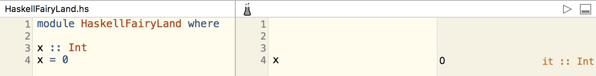

## 仙境里的Haskell（之二）

Haskell是一种延迟计算(lazy evaluation)的、有自动类型推断能力的、纯（pure）函数式编程语言。

Haskell是一门很容易学的编程语言（相信我），就像数学一样(｀﹏′)。核心语法非常少，那些高深东西都可以从我今天要讲的基本的东西里自行推导出来。 有没有见过数学老师讲课的时候忘了一个定理，然后在黑板上直接推导出来？ 就这么简单 ╮(╯▽╰)╭。

[上一篇](https://zhuanlan.zhihu.com/p/21371274?refer=damotou)里，我们准备了学习环境，其实也就是ghci repl和一个基本的编辑器就够用了。

打开ghci
```Haskell
Prelude> 3 * 4
12
```
多好的计算器~

在ghci里设置一下显示类型信息：
```Haskell
Prelude> :set +t
Prelude> 3 * 4
12
it :: Num a => a
```
设置了 +t后，执行结果后面会跟一行显示结果的类型,每次退出ghci后要重新设置。Haskell里声明变量及其类型的语法就如这个例子里的 it :: Num a => a , it是变量名，=>箭头前面的Num a是个类型约束，表示编译器现在不确定it是个什么具体类型，可能是整数，也可能是浮点数等等，只知道它是Num类型类（typeclass）的实例，因为它能做乘法运算。就目前的使用场景来说，知道它是Num也就够了。类型约束不是必须的。比如
```Haskell
Prelude> 'c'
'c'
it :: Char
```
这里编译器明确的确定了'c'的类型是Char。
顺便说一句，这个it变量是实际可用的
```Haskell
Prelude> it
'c'
it :: Char
```
字符串的类型实际上就是字符列表
```Haskell
Prelude> "damotou"
"damotou"
it :: [Char]
```
你可以用字符构造一个列表，结果是一样的
```
Prelude> ['d','m','o','t','o','u']
"dmotou"
it :: [Char]
```
列表的所有元素必须是相同类型的。
```Haskell
Prelude> [1,'a']

<interactive>:15:2:
    No instance for (Num Char) arising from the literal ‘1’
    In the expression: 1
    In the expression: [1, 'a']
    In an equation for ‘it’: it = [1, 'a']
```
编译器根据第一个元素，1，推断这个列表应该是(Num a)类型的，但是'a'是Char类型，而Char类型不是Num类型的实例，所以编译不过。

我这么啰嗦的解释这个编译错误，是因为用Haskell写程序大部分时间都在跟编译错误做斗争，当程序编译过了的时候基本上功能就是好的了。所以需要细心的体味编译器给出的***贴心***的编译错误~~~

Haskell支持元组（tuple）类型
```
Prelude> (1,'a')
(1,'a')
it :: Num t => (t, Char)
Prelude> ("Haskell",'H',1)
("Haskell",'H',1)
it :: Num t => ([Char], Char, t)
```
元组的类型就是其每个成员的类型。当然你可以把元组放到列表里
```
Prelude> [(1,'a'), (2,'b'), (3,'c')]
[(1,'a'),(2,'b'),(3,'c')]
it :: Num t => [(t, Char)]
```
你就得到了这个元组类型的列表。

有以上这些基本类型基本上就够我们在仙境里的使用了，哦忘了还有个布尔型：
```
Prelude> True
True
it :: Bool
Prelude> False
False
it :: Bool
Prelude> not True
False
it :: Bool
Prelude> True && False
False
it :: Bool
Prelude> False || True
True
it :: Bool
```
和大多数语言都是一致的，就不多解释了。 这下齐活了。

以上都是在程序员不主动写明类型的情况下，编译器自动推断的结果。 实际上我们是可以主动写明类型的：


ghci不支持这样的语法，所以你需要建个文件，叫做haskellfariyland.hs，然后在编辑器里输入这些内容。第一行的模块声明在仙境里不重要，所以不解释了，和文件名一致即可，照抄一下吧。

如果你和我一样用的是Haskellformac，那么在playground里输入x，就可以最右侧窗口看到x的执行结果，和在ghci里执行效果是一样的。你可以用你喜欢的编辑器，比如Atom写，然后在ghci里:l 文件名， 加载完成后，输入x回车，就能看到一样的结果了。

函数式编程，当然是以函数为核心的，所以我们要来学习add函数的n种写法, 第1种：
```Haskell
add :: (Int,Int) -> Int
add (x,y) = x + y
```
虽然Haskell具有很强的类型推断能力（也许是现有编程语言中最强的），但是习惯上一个模块的顶层函数定义和值定义都会声明类型，方便阅读代码和生成文档，而且先写函数的类型签名再写实现也是驱动我们思考程序设计的非常好的方法，被称为类型驱动开发（TDD）  (｀﹏′)

函数式编程里的函数，就如同数学意义上的函数 y = f(x),函数就是把一个数值转化成输出值的运算。
