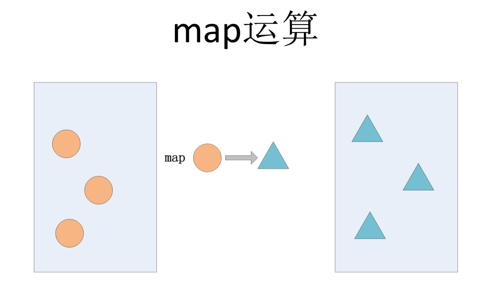
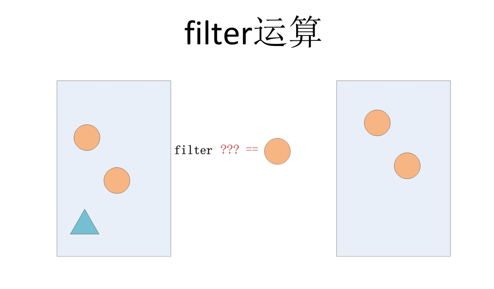
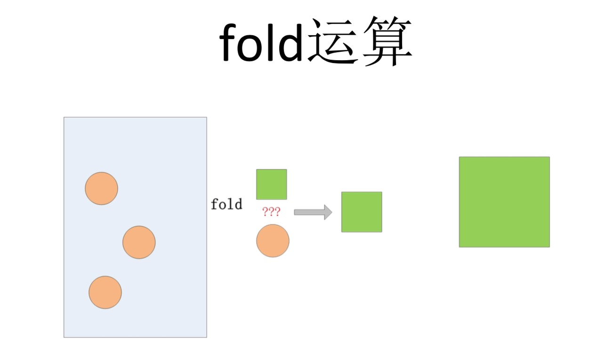
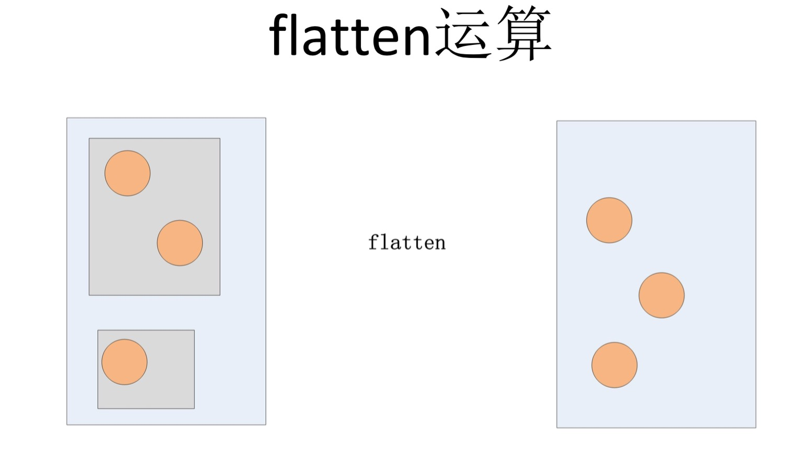

## 仙境里的Haskell（之六）—— 集合操作

102、105、48、21、22、16。 这是这个系列文章的点赞数队列。。。莫非太烧脑了？其实烧脑的部分还没有到啊。。。希望大家在本篇文章后给我一些反馈，谢谢。

好吧，今天先不继续写Monad了，写一篇集合操作吧，看看用Haskell怎么来处理这个列表~

先复习一下模式匹配：来写个head函数获取列表的第一个元素。
```Haskell
head' :: [a] -> a
head' [] = error "empty List"
head' (x:xs) = x
```
因为列表可能为空，所以对于空列表简单粗暴的抛个异常。顺便提一句，Haskell社区习惯用xs代表集合，x代表单个元素。
```Haskell
head' [102,105,48,21,22,16]
102

head' [1]
1

head' []
** Exception: empty List
```
更好的做法是把有可能出错的head函数签名改为返回Maybe a.
```Haskell
head'' :: [a] -> Maybe a
head'' [] = Nothing
head'' (x:xs) = Just x
```
这样不但避免出错，意图也表达的更清楚。
```Haskell
head'' [102,105,48,21,22,16]
Just 102

head'' []
Nothing
```

再复习一点递归，来写个filter函数，过滤出符合条件的数据。一如既往，Haskell函数式编程的习惯是先写下函数签名，然后慢慢去想怎么实现它。
```Haskell
filter' :: (a -> Bool) -> [a] -> [a]
```
给定一个a -> Bool的判定条件，给定一个a类型的列表，对每个元素做个判定，符合条件的就留下，否则过滤掉。
```Haskell
filter' _ [] = [] --空列表不管用什么条件过滤，结果还是空列表
filter' f (x:xs) = if f x then x : (filter' f xs) else filter' f xs
```

这些代码是帮助大家加强一下对之前学过的东西的记忆。 实际上这些函数当然都已经在[标准库](https://hackage.haskell.org/package/base-4.9.0.0/docs/Data-List.html)里实现过了，并不需要大家一天到晚写递归代码。

标注库里提供了大量的集合操作函数，也做了一些分类。 不过我把对集合常见操作重新做了分类，在实践中感觉更容易掌握和应用，在这里跟大家分享一下。<br/>
我认为对于一个集合，存在四种基本操作，把这四种操作吃透、记熟，其他操作都可以用这四种操作组合出来。
* map
* filter
* fold/reduce
* flatten

### map

对集合的每个元素做一个转换，得到一个转换后的元素的集合，这个运算的特点是元素个数不变，类型可能会变。
```Haskell
map :: (a -> b) -> [a] -> [b]

map (*2) [102,105,48,21,22,16]
[204,210,96,42,44,32]
```

### filter

对集合的每个元素做一个判定，得到通过判定的元素的集合，这个运算的特点是元素类型不变，个数可能会变。
```Haskell
filter :: (a -> Bool) -> [a] -> [a]

filter (>30) [102,105,48,21,22,16]
[102,105,48]
```

### fold/reduce

把列表**折叠**成一个值。<br/>
给定一个初始值作为累加器，将集合第一个元素取出来跟这个初始值做一个运算，得到一个新的累加器，再把后一个元素取出来跟这个新的累加器做运算得到下一个累加器，以此类推。 这个运算的特点是结果变成一个值，类型与初始值相同。
```Haskell
foldl :: (b -> a -> b) -> b -> [a] -> b

foldl (+) 0 [102,105,48,21,22,16]
314
```
314,这就是这个系列目前的总赞数咯。

### concat/flat

把嵌套的集合展开。
```Haskell
concat :: [[a]] -> [a]

concat [[1,2],[3,4]]
[1,2,3,4]
```
记住这四种操作的特点并善加组合，我们就可以知道什么时候该选用哪种操作。<br/>
比如我们想写一个dup函数，把一个集合的每个元素重复一遍，测试用例如下：
```Haskell
dup :: [a] -> [a]

dup [1,2,3]
[1,1,2,2,3,3]
```
这个函数实现只要一句语句，你能否写的出来？
```Haskell
dup = concat . map (\x -> [x,x])
```

如果我们想把列表做个反转，测试用例如下：
```Haskell
reverse' :: [a] -> [a]

reverse' [1,2,3]
[3,2,1]
```
实现的方法也是一句语句：
```Haskell
reverse' xs = foldl (\acc v -> v : acc) [] xs
```
你能否想到用[]作为初始值，然后把列表里的值一个个添加进去呢？

很多时候，我们会把列表的第一个值作为初始值来做折叠，我们可以利用模式匹配和foldl来实现一个reduce函数。
```Haskell
reduce :: (a -> a -> a) -> [a] -> a
reduce f (x:xs) = foldl f x xs
```
这个reduce函数不需要初始值。我们可以用它实现更简单的sum函数：
```Haskell
reduce (+) [1,2,3]
6
```

现在，我们已经有了reduce函数，留一道简单的作业：
```Haskell
let cond = ["x>2","y=10","z<30"]
如何把它拼接成SQL查询条件 "x>2 AND y=10 AND z<30"
```
